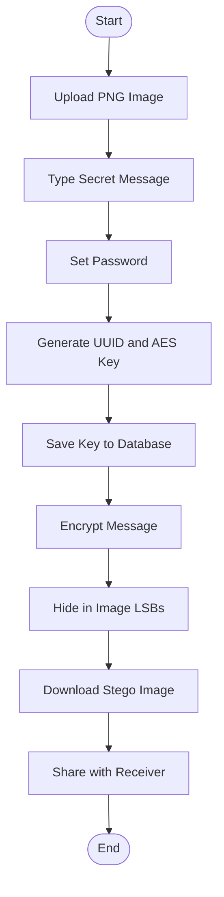
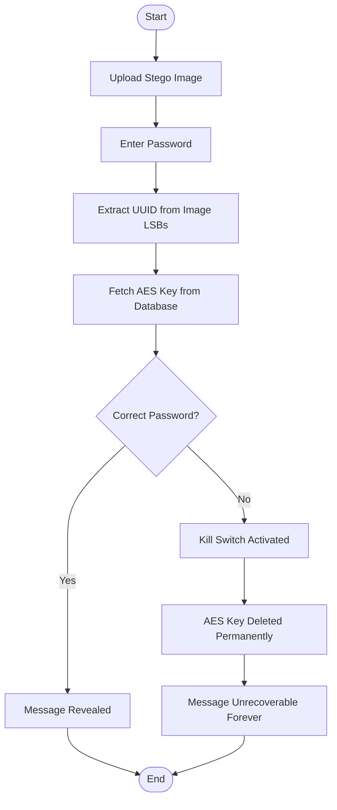
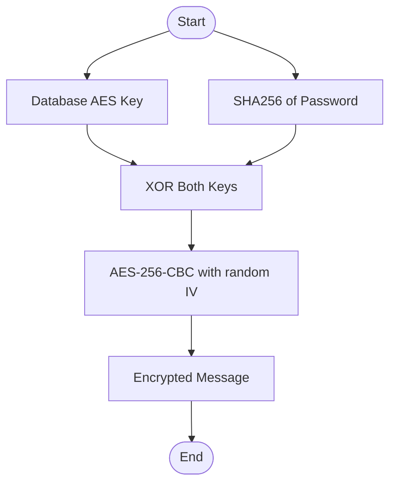
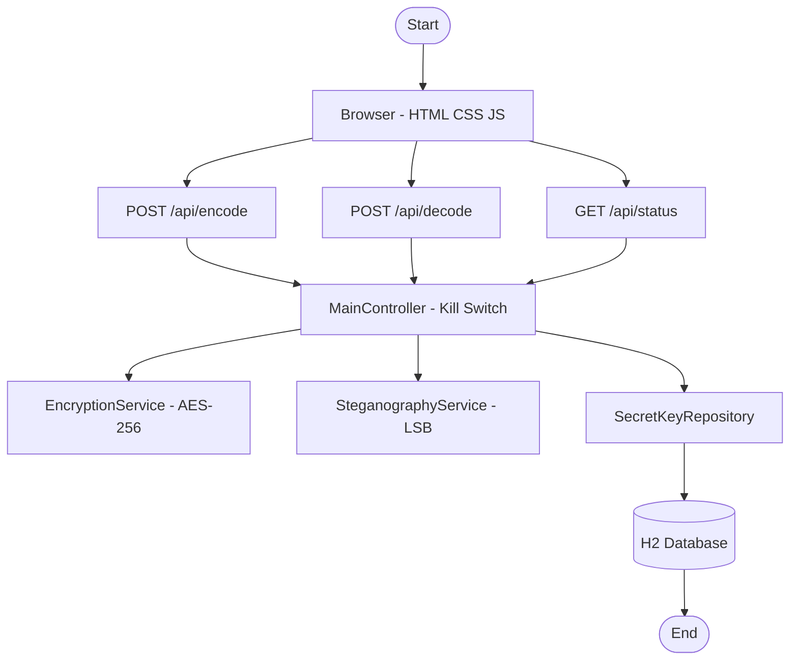

# 🔐 StegoVault

### Hide Encrypted Secrets Inside Ordinary Images

> **Team HackCypher** — Double-Slash Hackathon, Jadavpur University

---

## 🌐 Live Demo

🔗 https://stegovault-production.up.railway.app

## 🎥 Demo Video

[](https://drive.google.com/file/d/1-ZW_VvQMXIIMKRh2gMi3_jzg7I3pCv5H/view?usp=sharing)

> Click the button above to watch the full demo video of StegoVault in action.

### What the demo shows:

- ✅ Encoding a secret message into a PNG image
- ✅ Downloading the steganographic image
- ✅ Decrypting the message on another device
- 💀 Kill Switch getting triggered on wrong password

---

## 💡 What is StegoVault?

We built StegoVault for the Double-Slash Hackathon at Jadavpur University. The idea was simple — what if you could hide a secret message inside a completely normal image, and nobody could even tell it was there?

We combined two things to make it work:

- 🖼️ **Steganography** — the message hides inside the PNG pixels, invisible to the eye
- 🔒 **AES-256 Encryption** — the message is encrypted before it even gets hidden

The image looks totally normal. But it carries a secret payload inside.

> _"The best place to hide a secret is right out in the open."_

---

## ☠️ The Kill Switch — Our Killer Feature

> **One wrong password. Message gone. Forever.**

If the receiver enters the wrong password:

- The AES encryption key gets **deleted from the database instantly**
- The message becomes **mathematically unrecoverable** — even with the right password
- Even we, the developers, **cannot get it back**

No brute forcing. No retries. No mercy.

---

## 🚀 How It Works

### Sender Flow



### Receiver Flow



---

## 🔬 Tech Deep Dive

### LSB Steganography

Each pixel in a PNG has Red, Green, Blue channels — 8 bits each. We swap just the last bit of each channel with our data.

```
Original Red:  1 1 0 0 1 0 1 0  →  202
Modified Red:  1 1 0 0 1 0 1 1  →  203
                              ↑
                        only this bit changes
                        completely invisible to eyes
```

### Dual-Key AES-256 Encryption



Neither the database key alone nor the password alone can decrypt. You need both. Always.

---

## 🏗️ System Architecture



---

## 🛠️ Tech Stack

| Layer         | Technology                             |
| ------------- | -------------------------------------- |
| Backend       | Java 17 + Spring Boot 3.2.0            |
| Database      | H2 file-based — no installation needed |
| Encryption    | AES-256-CBC with IV                    |
| Steganography | LSB on PNG images                      |
| Frontend      | HTML5 + CSS3 + Vanilla JavaScript      |
| Build Tool    | Maven                                  |

---

## ⚙️ How to Run

**You need:** Java 17 + Maven installed

```bash
# Clone the repo
git clone https://github.com/Ayan933710/stegovault.git
cd stegovault

# Run
mvn spring-boot:run

# Open in browser
http://localhost:8080/landing.html
```

H2 Console for debugging:

```
http://localhost:8080/h2-console
JDBC URL → jdbc:h2:file:./stegovaultdb
Username → sa
Password → (leave empty)
```

---

## 📁 Project Structure

```
stegovault/
├── src/
│   └── main/
│       ├── java/com/stegovault/
│       │   ├── controller/
│       │   │   ├── MainController.java          ← REST API + Kill Switch
│       │   │   └── WebController.java           ← Root URL redirect
│       │   ├── entity/
│       │   │   └── SecretKey.java               ← JPA database entity
│       │   ├── repository/
│       │   │   └── SecretKeyRepository.java     ← Database access layer
│       │   ├── service/
│       │   │   ├── EncryptionService.java       ← AES-256-CBC engine
│       │   │   └── SteganographyService.java    ← LSB encode/decode
│       │   └── StegoVaultApplication.java       ← Entry point
│       └── resources/
│           ├── static/
│           │   ├── landing.html                 ← Landing page
│           │   ├── index.html                   ← Web app SPA
│           │   ├── style.css                    ← App styles
│           │   └── stylelanding.css             ← Landing styles
│           └── application.properties           ← Server config
├── pom.xml                                      ← Maven dependencies
└── README.md                                    ← This file
```

---

## 🌐 API Endpoints

| Method | Endpoint      | What it does                     |
| ------ | ------------- | -------------------------------- |
| `POST` | `/api/encode` | Hides encrypted message in image |
| `POST` | `/api/decode` | Extracts and decrypts message    |
| `GET`  | `/api/status` | Server health + active key count |

---

## 👥 The Team

| Member             | Role                   | What they built                      |
| ------------------ | ---------------------- | ------------------------------------ |
| **Narayan Shaw**   | Lead Developer         | Project setup, REST API, Kill Switch |
| **Faizan Alkama**  | Frontend Developer     | Landing page, Web App UI             |
| **Saloni Gupta**   | Backend / Cryptography | AES-256, Steganography services      |
| **Saurav Choubey** | Database Admin / QA    | Entity, Repository, Testing          |

---

## ⚠️ Important Notes

- Only **PNG images** work — JPEG compression destroys the hidden bits
- Do **NOT** screenshot or resize the stego image — it corrupts the data
- The Kill Switch is **irreversible by design** — no recovery possible
- H2 database saves data between restarts — app band karo kholo, data wahi milega

---

_Built with 🔥 by 1st Year B.Tech CSE Team HackCypher (Track : CYBERSECURITY) — Double-Slash Hackathon 2026_

```

```
